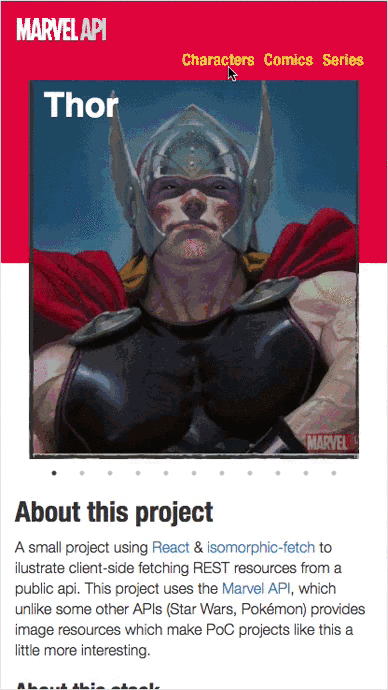

## About
This project was bootstrapped with [Create React App](https://github.com/facebookincubator/create-react-app)

A small project using React & isomorphic-fetch to illustrate client-side fetching REST resources from a public api. This project uses the [Marvel API](http://developer.marvel.com/docs)

Started from [create-react-app](https://github.com/facebookincubator/create-react-app), extended via [react-custom-scripts](https://github.com/kitze/custom-react-scripts) for including SASS functionality. Base styles are from Bootstrap with minimal customization.

#### GIF!

